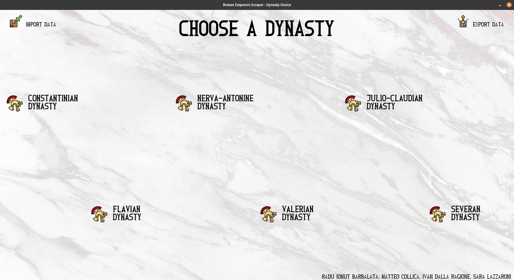
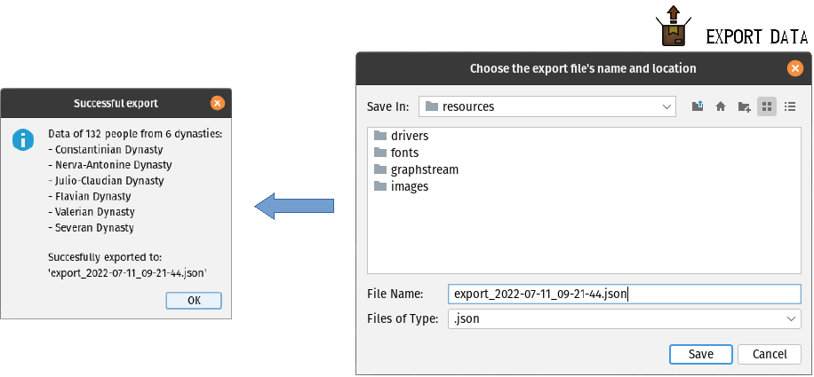
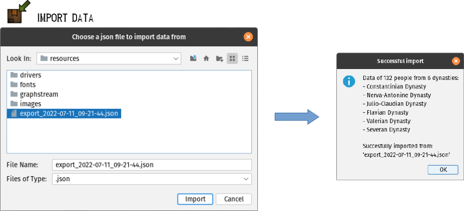
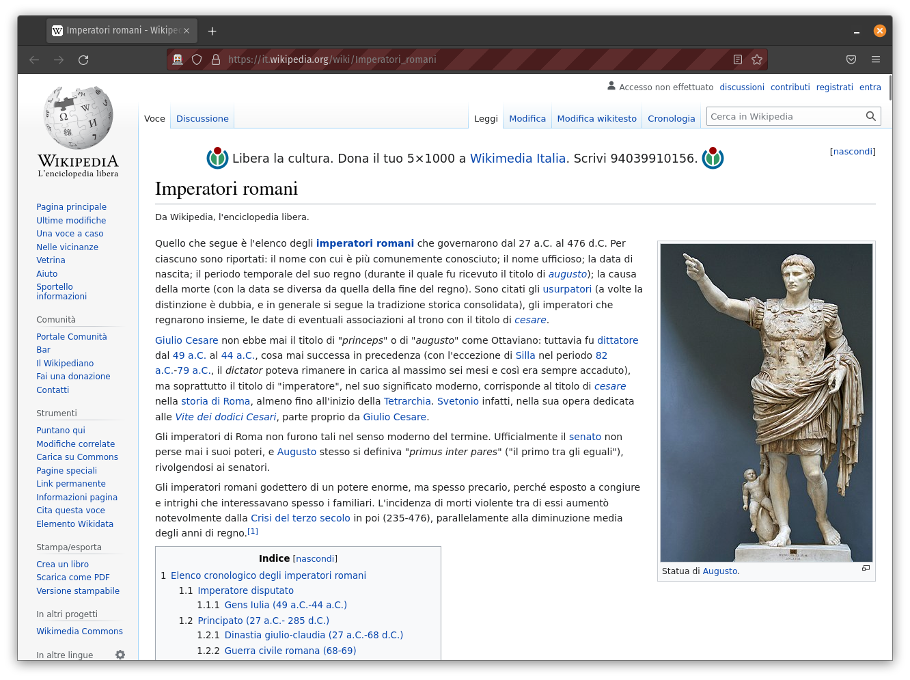
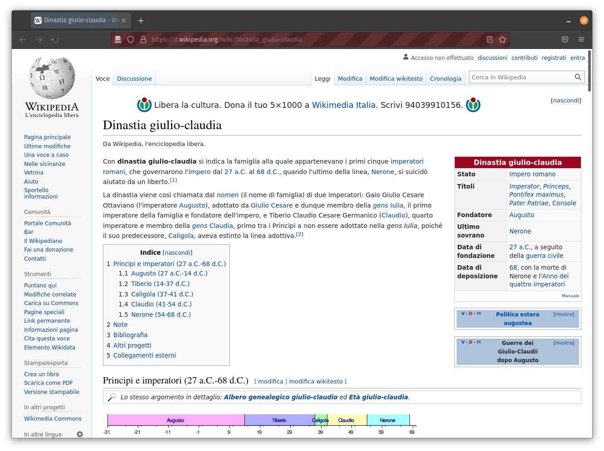
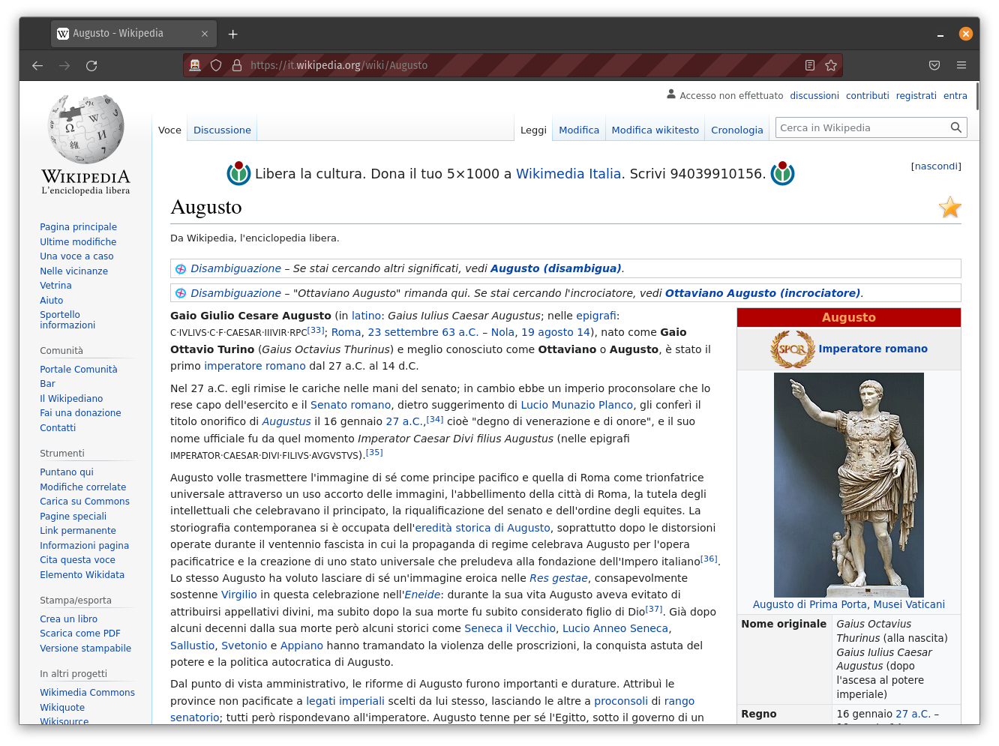
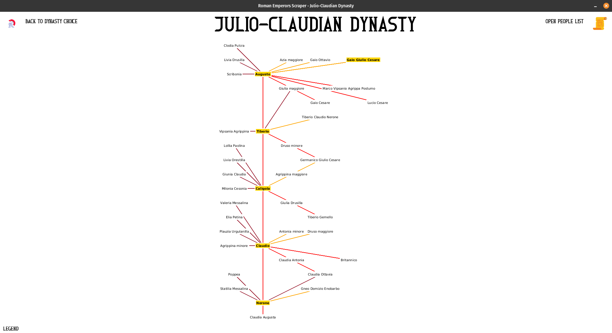
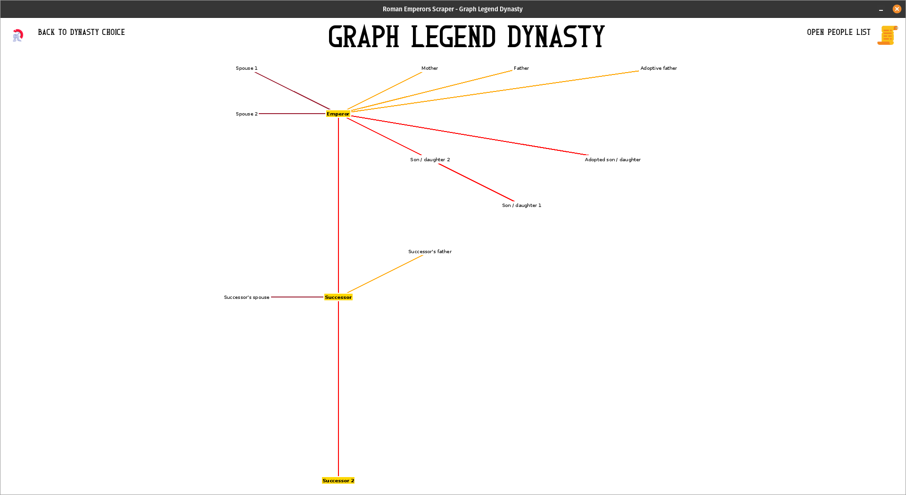
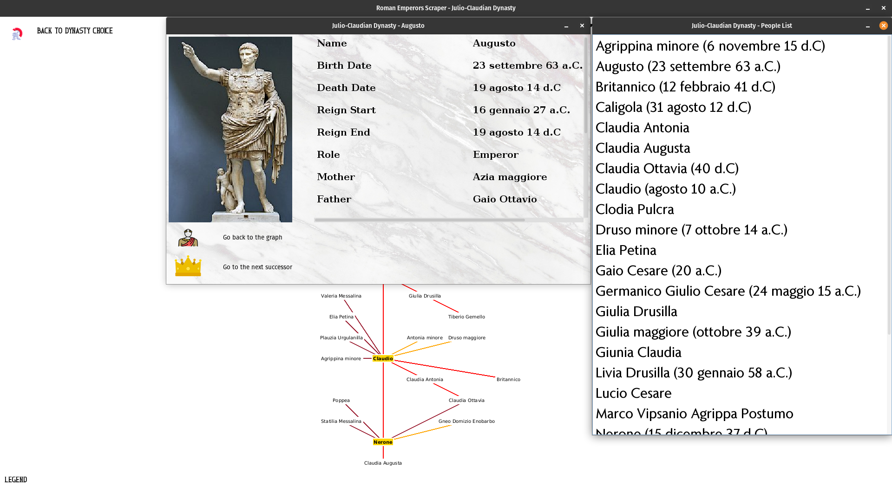

# RomanEmperorsScraper

## About the Project

RomanEmperorsScraper is a product of the collaboration of [Radu Ionut Barbalata](https://github.com/i0nut02/), [Matteo Collica](https://github.com/matypist/), [Ivan Dalla Ragione](https://github.com/Ivanettoss/) and [Sara Lazzaroni](https://github.com/saralazza/) as a university project for the oral examination of the "[Metodologie di Programmazione](https://corsidilaurea.uniroma1.it/it/view-course-details/2021/29923/20210916103754/ad1151e3-90e5-4009-801c-8d867e9dc12f/68651d4a-a4bd-430f-a2c9-0627c5463bf7/0fa6b253-7608-4a35-9065-0c61929ea3a5/4c972aa5-ec0a-4b9d-8208-917d257aa78a)" teaching at Sapienza University of Rome.

The original requirements concerned the creation of one or more family trees relating to each dynasty of Roman Emperors, with the aim of visualising the various parental relationships that exist, through the technique of web scraping and the use of the [Selenium](https://www.selenium.dev/) framework.

Our group subsequently implemented many additional functionalities, such as the possibility of importing and exporting data obtained through scraping and an interface for visualising the information, also obtained through scraping, of the dynasty members. Furthermore, in contrast to some other works on the subject, we have preferred an approach that allows the user to choose the dynasties he or she wants to scrape, rather than starting, and thus making the user wait for, the scraping of all dynasties when starting the program. Particular attention was also paid to maintaining the possibility of using the program with any browser among those supported by Selenium and with any operating system based on Windows, macOS or Unix.

The project was finally presented orally on 15 July 2022 to Professors [Gabriele Etta](https://research.uniroma1.it/researcher/663eaa627732b762ffb27f464fbb77da63a5bae2f887e36c98aeaa42) and [Walter Quattrociocchi](https://corsidilaurea.uniroma1.it/user/37050), receiving a grade of 30 cum laude.

## Features

### Dynasty choice


### Exporting and importing data




### Scraping of dynasties data

#### 1) Scraping of the dynasties names and URLs



#### 2) Scraping of a dynasty's information and retrieval of its founder



#### 3) Scraping of dynasty members starting from the dynasty founder



### Visualization of a dynasty's genealogical tree


### Visualization of a graph legend for the genealogical trees


### Visualization of a dynasty member's personal information


## Getting Started

### Compiling

Thanks to the use of [Maven](https://maven.apache.org/) and the corresponding configuration file pom.xml distributed in this GitHub repository, you can import the project into your favourite IDE (in our case it was [Intellij IDEA](https://www.jetbrains.com/idea/), but we also tested it on [Eclipse](https://eclipseide.org/release/) for example) and easily compile and run it.

### Requirements

* An operating system Windows, macOS or Unix-based;

* [Firefox](https://www.mozilla.org/it/firefox/new/), [Chrome](https://www.google.it/chrome/index.html), [Edge](https://www.microsoft.com/it-it/edge), Internet Explorer or Safari - having at least one of them installed is required by Selenium (and therefore by our program) to be used for scraping.

### Running

To facilitate the running of the program we packaged it as a JAR for you, so that running it is as easy as double clicking on the JAR file or executing the following command on your terminal:
```
java -jar RomanEmperorsScraper.jar
```

Some additional options are also provided when executing from a terminal:
* Add a **-t** argument to the command to run some tests of the program's correct functioning instead of the program itself;
* Add a **-d** argument to print some additional debug information during the program's execution.

*Please ensure to execute the shipped JAR with a Java version later than 8 (as it is the one we, developers, compiled and packaged as JAR the project with).*

## Documentation

If you wish to know more about our classes and methods please feel free to check our documentation comments in source files or the [Javadoc](https://matypist.github.io/RomanEmperorsScraper/) itself.

## Acknowledgments

### Icons

| Icon                                                                                  | Filename                                                                                                                   | Website                                         | Author                                                             |
|---------------------------------------------------------------------------------------|----------------------------------------------------------------------------------------------------------------------------|-------------------------------------------------|--------------------------------------------------------------------|
|  | [choice/DynastyChoiceButton_scraped.png](src/main/resources/resources/images/icons/choice/DynastyChoiceButton_scraped.png) | [FlatIcon](https://www.flaticon.com/)           | [Freepik](https://www.flaticon.com/authors/freepik)                |
|                 | [choice/ExportButton.png](src/main/resources/resources/images/icons/choice/ExportButton.png)                               | [Icons8](https://icons8.com/)                   | [xnimrodx](https://icons8.com/icons/authors/3ayxolOIttPV/xnimrodx) |
|                 | [choice/ImportButton.png](src/main/resources/resources/images/icons/choice/ImportButton.png)                               | [Icons8](https://icons8.com/)                   | [xnimrodx](https://icons8.com/icons/authors/3ayxolOIttPV/xnimrodx) |
|            | [people/BackToGraphButton.png](src/main/resources/resources/images/icons/people/BackToGraphButton.png)                     | [Shutterstock](https://www.shutterstock.com/it) | [vectorwin](https://www.shutterstock.com/it/g/vectorwin)           |
|          | [people/GoToSuccessorButton.png](src/main/resources/resources/images/icons/people/GoToSuccessorButton.png)                 | [Icons8](https://icons8.com/)                   | [Icons8](https://icons8.com/about)                                 |
|        | [tree/BackToChoiceFrameButton.png](src/main/resources/resources/images/icons/tree/BackToChoiceFrameButton.png)             | [Icons8](https://icons8.com/)                   | [Icons8](https://icons8.com/about)                                 |
|           | [tree/PeopleListOpenButton.png](src/main/resources/resources/images/icons/tree/PeopleListOpenButton.png)                   | [Icons8](https://icons8.com/)                   | [Icons8](https://icons8.com/about)                                 |
|                             | [AppIcon.png](src/main/resources/resources/images/icons/AppIcon.png)                                                       | [HiClipart](https://www.hiclipart.com/)         |                                                                    |

Some other icons used in our program (like those named with a '_roll' suffix) are modified versions of the enumerated ones.

### Images

#### Dynasty choice background image

* Source: [Freepik](https://www.freepik.com/free-photo/close-up-white-marble-texture-background_3472378.htm) (Author: [rawpixel-com](https://www.freepik.com/author/rawpixel-com))


#### PersonCard default image

* Source: [Clipground](https://clipground.com/spqr-clipart.html)